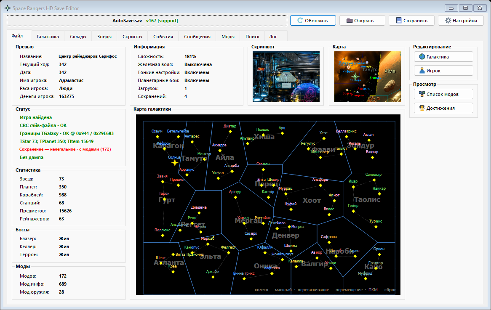
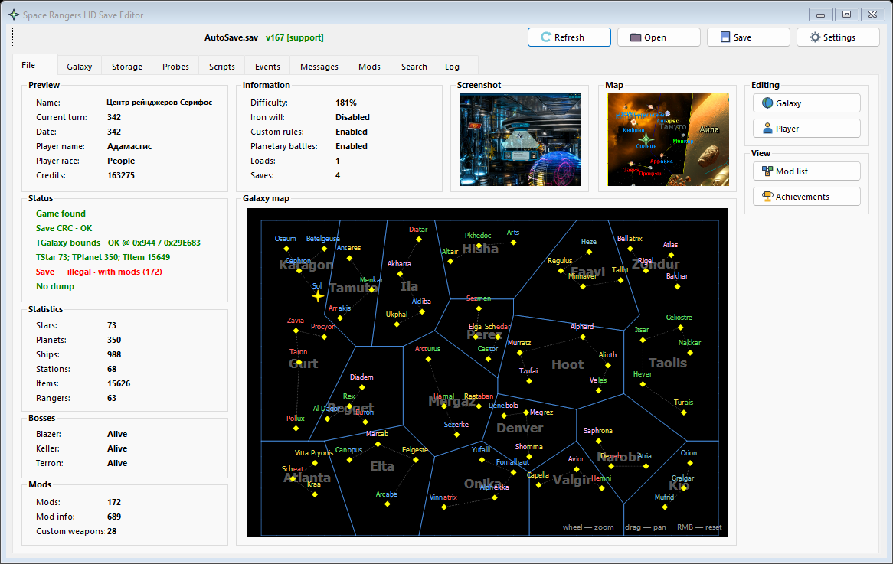

# Space Rangers HD Save Editor

[](https://github.com/Xenomorphchyma/Space-Rangers-HD-Save-Editor/actions/workflows/build.yml)
[](LICENSE)
[](#сборка)

Независимый open-source редактор сохранений **Space Rangers HD: A War Apart**
для Windows. Он читает SAV напрямую, отображает игровые названия из локальных
каталогов игры и сохраняет изменения в отдельную копию, не перезаписывая
исходный файл.

Автор и сопровождающий проекта: **[Xenomorphchyma](https://github.com/Xenomorphchyma)**.

## Интерфейс

### Русский



### English



## Установка

1. Откройте раздел [Releases](https://github.com/Xenomorphchyma/Space-Rangers-HD-Save-Editor/releases).
2. Скачайте архив `Space-Rangers-HD-Save-Editor-*-win-x86.zip`.
3. Распакуйте его в отдельную папку и запустите `SRHDSaveEditor.exe`.

Редактор рассчитан на Windows с установленным .NET Framework 4.8. Файлы игры
можно указать в настройках; внешний ModKit для работы приложения не требуется.

## Возможности

- чтение, проверка CRC, расшифровка и пересборка SAV;
- галактика, звёзды, планеты, корабли, предметы, скрипты и сообщения;
- склады, трюм, магазины, модовое хранилище и пользовательское оружие;
- карта галактики и карты систем с игровыми названиями и разными маркерами
  объектов, масштабированием, перемещением и включаемыми по кнопке переходами
  в соседние системы;
- форматированное отображение игровых новостей с отдельными режимами чистого
  текста и редактируемого исходника с тегами;
- статистика, параметры игрока, достижения и признак легального/нелегального
  сохранения;
- поддержка обычных и модифицированных сохранений с побайтным сохранением
  неизвестных модовых данных;
- русские названия из установленной игры, полная локализация всех форм и
  безопасное исправление устаревших ссылок каталога по CRC.

Сетевого кода, телеметрии, запуска ModKit/BlockParEditor/RScript и скрытого
управления мышью в приложении нет.

## Совместимость

- форматы SAV версий 166 и 167;
- обычные и модифицированные сохранения;
- Windows x86/x64 при наличии .NET Framework 4.8;
- игровые каталоги необязательны, но нужны для полных названий и проверки CRC.

Неизвестные модовые структуры сохраняются побайтно и остаются read-only до
появления проверенного сериализатора. Перед изменениями всё равно делайте
резервную копию сохранения.

## Сборка

Требуются Windows, .NET Framework 4.8 и PowerShell 5+.

```powershell
.\tools\build.ps1
```

Результат: `release\SRHDSaveEditor.exe` (x86).

Публикуемый архив создаётся после успешной проверки:

```powershell
.\tools\package_release.ps1
```

Скрипт сверяет SHA-256 EXE с `release\manifest.json` и упаковывает бинарник,
манифест, README, changelog, лицензию и уведомления в каталог `release`.

Полная доступная локально проверка:

```powershell
.\tools\verify.ps1
```

Для регрессии на собственном наборе SAV передайте текстовый файл с одним
абсолютным путём на строку:

```powershell
.\tools\verify.ps1 `
  -CorpusList .\build\local-corpus-paths.txt `
  -GamePath 'D:\Games\Space Rangers HD A War Apart'
```

SAV, локальные пути, содержимое игры и диагностические снимки тестов не входят
в репозиторий. Два снимка интерфейса с загруженным примером сохранения находятся
в `docs/screenshots`; сам SAV отдельно не распространяется.

## Безопасное использование

Редактор по умолчанию предлагает новый файл с суффиксом `.SRHDSaveEditor.sav`
и отказывается перезаписывать существующий файл. Всё равно
храните резервную копию: формат игры не документирован, а сторонние моды могут
добавлять неизвестные структуры. Не публикуйте SAV без проверки — в них могут
быть имена и другие пользовательские данные.

## Происхождение

Это отдельный проект с собственным именем, сборкой, кодовой базой интерфейса и
графикой. Desktop Cassandra v1.11 использовалась как исторический эталон
совместимости. Подробности и ссылка приведены в [NOTICE.md](NOTICE.md).
`Xenomorphchyma` не указан автором Cassandra и не претендует на права на игру
или сторонние материалы.

## Лицензия

Самостоятельно написанный код проекта распространяется по лицензии MIT,
copyright © 2026 Xenomorphchyma. Игра, Cassandra, сторонние моды и отдельно
перечисленные данные совместимости этой лицензией не покрываются. См.
[NOTICE.md](NOTICE.md) и [THIRD-PARTY-NOTICES.md](THIRD-PARTY-NOTICES.md).
